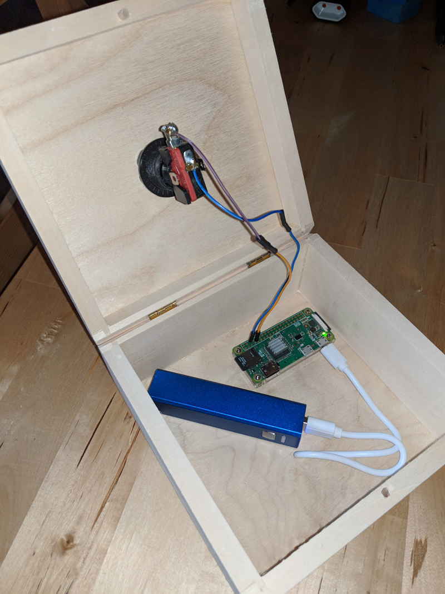
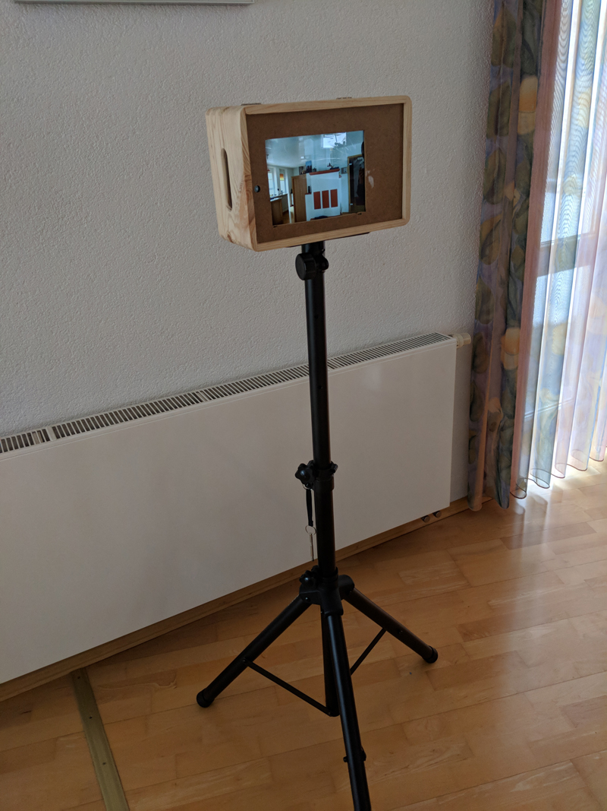
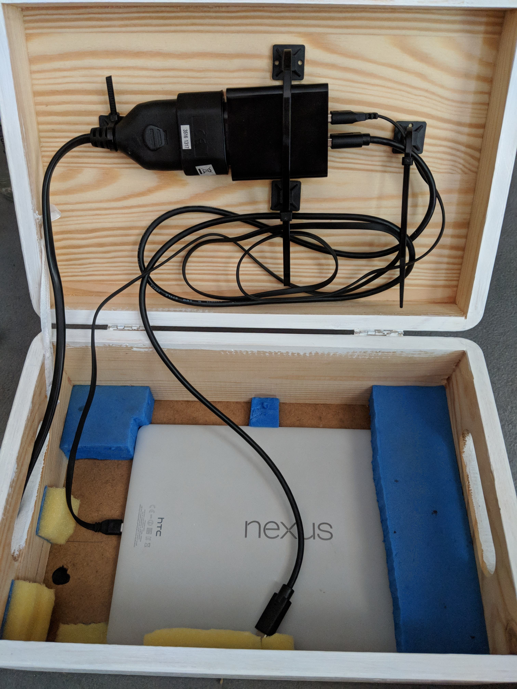
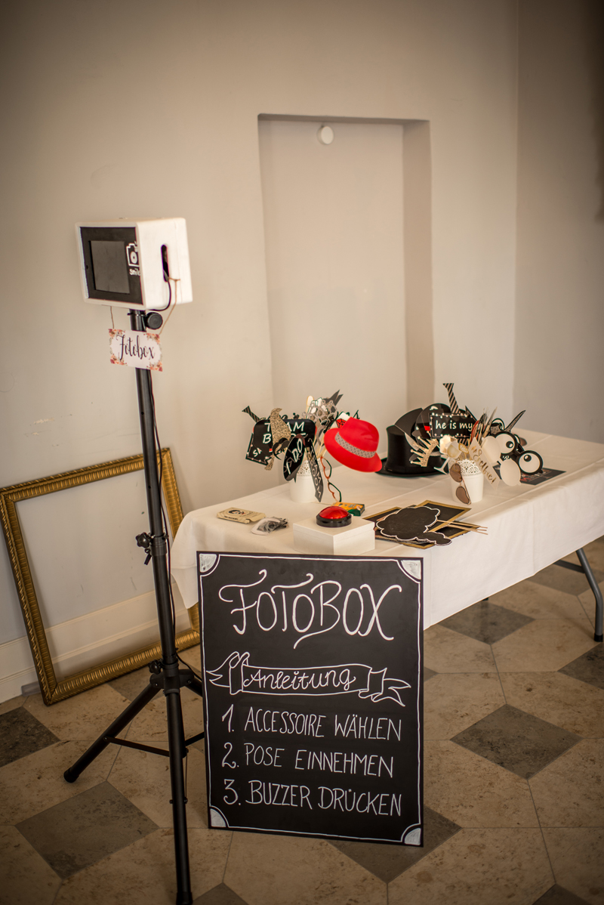

# Photobooth

Photobooth is an Android application, connected to an external button and an external camera. The Android devices uses its front facing camera to show a preview image and when the button is pressed, triggers taking a photo with the external camera (and displaying the resulting image).

## setup ##

button -- Raspberry Pi ----> Android tablet <----> GoPro camera

                          or
                          
button -- Raspberry Pi ----> Android tablet <----> Android camera

## photos ##

<table sytle="border: 0px;">
<tr>
<td></td>
<td></td>
<td></td>
<td></td>
<td></td>
</tr>
</table>
